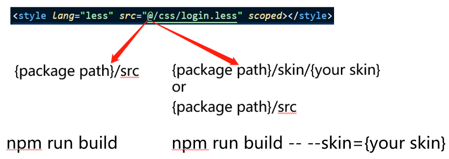

# dynamic-alias-resolve-plugin



## Introduction

Thanks for the help of [enhanced-resolve](https://github.com/webpack/enhanced-resolve), we can define alias for path, but it's static, in some cases we may want alias point to A path or B path, in other words, we want dynamic alias. [enhanced-resolve](https://github.com/webpack/enhanced-resolve) is based on [tapable](https://github.com/webpack/tapable), so we can write a plugin to make it.

Read this in other languages: [english](./README.md), [简体中文](./README.zh-cn.md)

## Prerequisites

This module requires webpack v4 and above.

## Installation

```sh
npm install -D dynamic-alias-resolve-plugin
```

## Usage

In your webpack config, require() the dynamic-alias-resolve-plugin plugin as follows:

```js
const DynamicAliasResolvePlugin = require("dynamic-alias-resolve-plugin");
```

and finally, add the plugin to your resolve configuration's plugins array

```js
// https://webpack.js.org/configuration/resolve/#resolveplugins
resolve: {
  plugins: [
    new DynamicAliasResolvePlugin({
      // alias you want to make it dynamic
      alias: "@",
      // pathA or pathB should be replaced with real path
      // "request" is raw request object from enhanced-resolve
      // "alias" is matched alias of current request.(eg. "@" in "@/login.less")
      dynamic: (request, alias) => "pathA or PathB",
      // we just want less file to be handled by this plugin
      pattern: /\.less$/,
    }),
  ];
}
```

## Options

| properties |                          type                           |              default              |
| :--------: | :-----------------------------------------------------: | :-------------------------------: |
|   alias    |                     Array\<string\>                     |               ['@']               |
|  dynamic   | function(request,alias)=>string\|null\|false\|undefined |             ()=>null              |
|  pattern   |                         RegExp                          |               /.\*/               |
| extensions |                     Array\<string\>                     | ["js", "mjs", "ts", "jsx", "tsx"] |

## Description Of Options

### alias

alias you want to make it dynamic

### dynamic

return value should be `absolute path`,all false value('',false,null) will be ignored. `request` is raw enhanced-resolve request object, `alias` is current alias you want make it dynamic. (eg. "@" in "@/login.less")

### pattern

files needs handled by this plugin

### extensions

When we import a module we always ignore the extension, for instance, if we want to import something from `{path}/a.js` we just write `import {something} from {path}/a` instead of `import {something} from {path}/a.js`, which is convenient. However, when we resolve a module to an absolute path, we must have the file extension info. If you specified this option, we will try to match extensions that you specied when we encounter a module that don't have a file extension, or we will use the default extensions(["js", "mjs", "ts", "jsx", "tsx"]).
