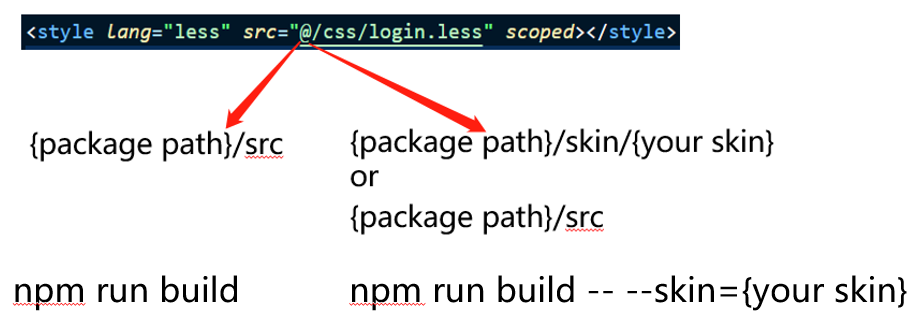

# dynamic-alias-resolve-plugin



## 介绍

在 webpack 中，我们能为复杂路径定义静态的 alias（某个 alias 始终解析到用户定义的某个实际地址），但是某些情况下我们可能想要动态的 alias，比如说我们构建某个皮肤版本，对于样式和图片文件，如果皮肤下重写了样式我们希望 alias 解析到皮肤目录下，如果皮肤下未重写样式我们想 alias 解析到默认目录。借助 [enhanced-resolve](https://github.com/webpack/enhanced-resolve) 的插件机制，我们能通过 resolve 插件很轻松的实现此功能。

通过其他语言阅读此文件: [english](./README.md), [简体中文](./README.zh-cn.md)

## 前提

本插件依赖于 webpack 4 以上

## 安装

```sh
npm install -D dynamic-alias-resolve-plugin
```

## 使用

在 webpack 配置文件顶部引入本插件:

```js
const DynamicAliasResolvePlugin = require("dynamic-alias-resolve-plugin");
```

然后在 resolve 的 plugins 数组中添加本插件：

```js
// https://webpack.js.org/configuration/resolve/#resolveplugins
resolve: {
  plugins: [
    new DynamicAliasResolvePlugin({
      // 需要动态解析的alias数组,提供字符串的话会在内部被转成数组
      alias: ["@"],
      // pathA or pathB 需要被替换为实际路径（仅支持绝对路径，插件内部依赖于绝对路径判断替换后的路径是否存在）
      // 这里的request是enhanced-resolve的原生request对象
      // 这里的alias是当前request匹配到的alias （例如："@/login.less" 中的 "@" ）
      dynamic: (request, alias) => "pathA or PathB",
      // 指定哪些文件需要经过本插件处理
      pattern: /\.less$/,
    }),
  ];
}
```

## Options

| properties |                                                                                                   description                                                                                                    |              type               | default  |
| :--------: | :--------------------------------------------------------------------------------------------------------------------------------------------------------------------------------------------------------------: | :-----------------------------: | :------: |
|   alias    |                                                                                            需要动态解析的 alias 数组                                                                                             |      string, Array<string>      |   '@'    |
|  dynamic   | 返回值是一个路径字符串（绝对路径），所有的假值都会被忽略（false,'',null）。这里的 request 是 enhanced-resolve 的原生 request 对象，这里的 alias 是当前 request 匹配到的 alias （例如："@/login.less" 中的 "@" ） | function(request,alias)=>string | ()=>null |
|  pattern   |                                                                                          指定哪些文件需要经过本插件处理                                                                                          |             RegExp              |  /.\*/   |
